**CMSI 3700** Interaction Design, Fall 2024

# Exploring User Engagement in Book Tracking Apps

- Kate Galvin
- Raihana Zahra
- Giselle Eliasi

## Study Description

The systems we compared are two reading tracking apps: _Goodreads_ and _Storygraph_. These applications are direct competitors and despite their popularity with avid readers, they were unfamiliar to our testers. This allowed us to conduct learnability testing.

Chosen Tasks:
- Task 1: Find a specific book  
    Participants are asked to locate a particular book (Malibu Rising by Taylor Jenkins Reid) on both Goodreads and StoryGraph. They can use the search bar, browse genres, or filter by categories as needed. The goal is to assess how intuitive and efficient the platforms' search and discovery mechanisms are.

-  Task 2: Track reading progress  
    Participants are asked to update their reading progress of the chosen book to a specific page/percentage. This involves changing the book status to "Currently Reading" and nagivating to the home page to update progress to a given percentage or page of the book. This task evaluates how easy it is to interact with and update reading data on each platform.

- Task 3: Give a book a five star rating  
    Participants are instructed to locate a chosen book and give a five star rating. This task assesses the usability of the rating features on both platforms, focusing on the ease of rating a book and understanding how the rating system works.

Chosen Metrics:
- Metric 1 - Learnability: For each task, we gave a short verbal direction without providing any guidance on how to complete the task. Our participants were unfamiliar with the two platforms. For each task we timed how long it took the participant to complete the task. The three tasks were performed sequentially, with each task being timed individually. For the "find a specific book" task, the participant began on the app's homepage and was timed until they successfully navigated to the book. For "track reading progress", the participant began on the book's page and from there attempted to update the reading progress to the specified amount. For "give a book a five star rating", the participant began on the book's page and attempted to assign the rating.
- Metric 2 - Errors: During each task we observed the participant, counting each error they experienced during the process of attempting to complete the task.
- Metric 3 - Satisfaction: After each task, we asked the participant to rate their satisfaction with the experience of completing the task. The rating was on a scale of 1 (no satisfaction) to 10 (high satisfaction).

## Study Results
For data collection, each of the three metrics are measured for each participant for both applications. The data sheet is organized by tasks on the x axis, further split into the three metrics which were learnability, errors, and satisfaction. We measured learnability by calculating the time it takes for the participant to complete the task; measured errors by observing the amount of mistakes it took for them to complete the task; and measured satisfaction by surveying on a scale of 1-10 how the participant felt about completing each task with their respective application. 

Trials using Goodreads are on the upper half of the table while trials using StoryGraph are on the lower half. Data was collected from 10 participants, totaling 10 surveys for each application.

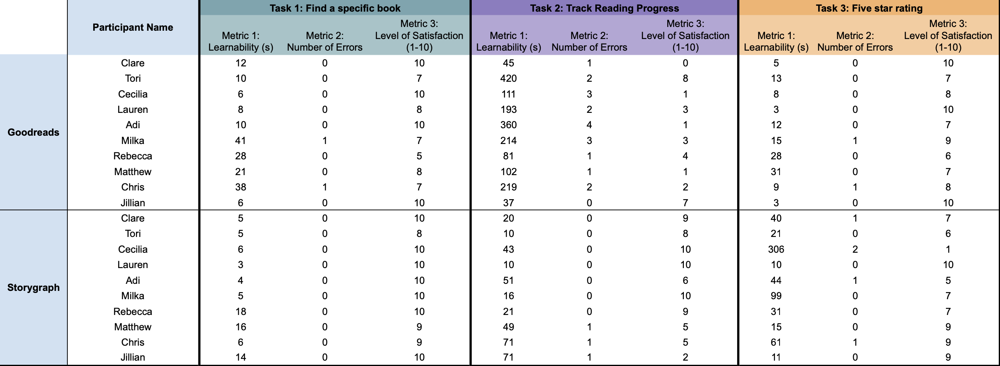

### Data Analysis

#### Task 1 Results
*Efficiency: Time to complete task in seconds.*

| User | Time (Goodreads) | Time (StoryGraph) |
|:------:|:-----------:|:------------:|
| 1    | 12s        | 5s          |
| 2    | 10s        | 5s          |
| 3    | 6s         | 6s          |
| 4    | 8s         | 3s          |
| 5    | 10s        | 4s          |
| 6    | 41s        | 5s          |
| 7    | 28s        | 18s         |
| 8    | 21s        | 16s         |
| 9    | 38s        | 6s          |
| 10   | 6s         | 14s         |
| **Average Time** | **18s**       | **8.2s**       |

*Errors: Actions taken by user that were unexpected or unintended.*

| User | Error (Goodreads) | Error (StoryGraph) |
|:------:|:-----------:|:------------:|
| 1      | N/A         | N/A          |
| 2      | N/A         | N/A          |
| 3      | N/A         | N/A          |
| 4      | N/A         | N/A          |
| 5      | N/A         | N/A          |
| 6      | typed the full author name with book title and database did not return the correct book       | N/A          |
| 7      | N/A        | N/A         |
| 8      | N/A        | N/A         |
| 9      | typed the full author name with book title and database did not return the correct book        | N/A          |
| 10     | N/A         | N/A         |
| **Total of Users with Errors** | **2**       | **0**       |

*Satisfaction: How easy was it for users to use the product/are they likely to use the product again.*

| Goodreads | StoryGraph |
|:-----------:|:------------:|
| 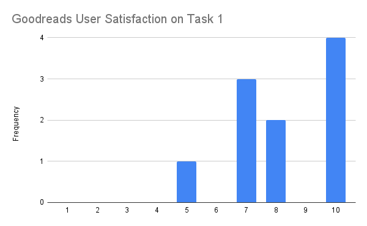           | 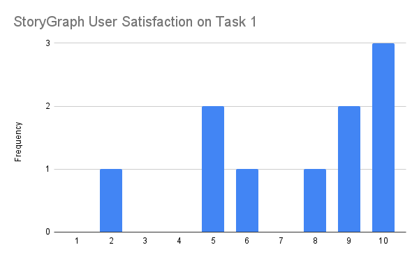          |
| **Average: 8.2**          | **Average: 9.6**          |

#### Task 2 Results
*Efficiency: Time to complete task in seconds.*

| User | Time (Goodreads) | Time (StoryGraph) |
|:------:|:-----------:|:------------:|
| 1    | 45s           | 20s          |
| 2    | 420s          | 10s          |
| 3    | 111s          | 43s          |
| 4    | 193s          | 10s          |
| 5    | 360s          | 51s          |
| 6    | 214s          | 16s          |
| 7    | 81s           | 21s          |
| 8    | 102s          | 49s          |
| 9    | 219s          | 71s          |
| 10   | 637s          | 71s          |
| **Average Time** | **178.2s**       | **36.2s**       |

*Errors: Actions taken by user that were unexpected or unintended.*

| User | Error (Goodreads) | Error (StoryGraph) |
|:------:|:-----------:|:------------:|
| 1      | couldn’t find how to input progress         | N/A          |
| 2      | clicked on different tabs + was not on the right screen         | N/A          |
| 3      | was about to comment the page number, didn’t know where to look for update progress button and was stuck on book info page         | N/A          |
| 4      | didn’t know where to find the track reading progress section, was on different pages that was not the home page         | N/A          |
| 5      | went to edit activity first, didn't add book to currently reading first, kept going to review page, kept going to My Books         | N/A          |
| 6      | kept going to My Books, went to review page, profile page         | N/A          |
| 7      | just couldn’t find how to input progress         | N/A          |
| 8      | didn’t understand what to do         | did not know he had to change to “currently reading”          |
| 9      | went to My Books, went to edit my activity         | scrolled past the track progress button          |
| 10     | N/A         | did not know how to track progress kept clicking other things          |
| **Total of Users with Errors** | **9**       | **3**       |

*Satisfaction: How easy was it for users to use the product/are they likely to use the product again.*

| Goodreads | StoryGraph |
|:-----------:|:------------:|
| 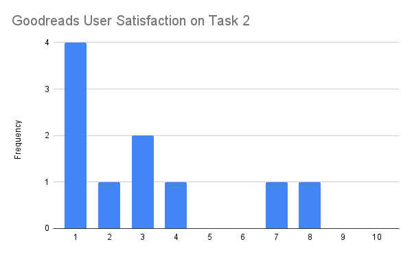           | 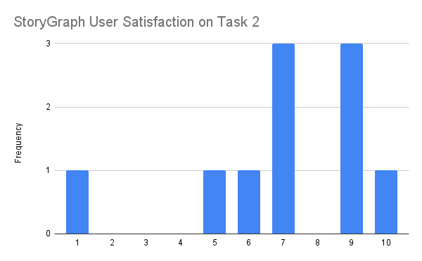          |
| **Average: 3.1**          | **Average: 7.4**          |

#### Task 3 Results
*Efficiency: Time to complete task in seconds.*

| User | Time (Goodreads) | Time (StoryGraph) |
|:------:|:-----------:|:------------:|
| 1    | 5s         | 40s          |
| 2    | 13s        | 21s          |
| 3    | 8s         | 306s         |
| 4    | 3s         | 10s          |
| 5    | 12s        | 44s          |
| 6    | 15s        | 99s          |
| 7    | 28s        | 31s          |
| 8    | 31s        | 15s          |
| 9    | 9s         | 61s          |
| 10   | 3s         | 11s          |
| **Average Time** | **12.7s**       | **63.8s**       |

*Errors: Actions taken by user that were unexpected or unintended.*

| User | Error (Goodreads) | Error (StoryGraph) |
|:------:|:-----------:|:------------:|
| 1      | N/A         | didn’t know have to mark book as read before reviewing          |
| 2      | N/A         | N/A          |
| 3      | N/A         | didn’t know have to mark book as read before reviewing, was on different pages scrambling          |
| 4      | N/A         | N/A          |
| 5      | N/A         | on different pages          |
| 6      | clicked the main star review under the book title         | N/A          |
| 7      | N/A         | N/A          |
| 8      | N/A         | N/A          |
| 9      | clicked the main star rating of the book         | didn't know that you had to mark book as finished          |
| 10     | N/A         | N/A          |
| **Total of Users with Errors** | **2**       | **4**       |

*Satisfaction: How easy was it for users to use the product/are they likely to use the product again.*

| Goodreads | StoryGraph |
|:-----------:|:------------:|
| 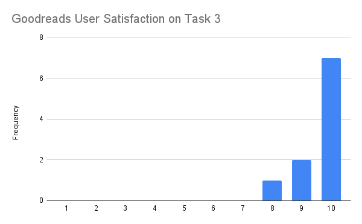           | 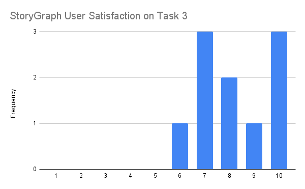          |
| **Average: 8.2**          | **Average: 7**          |

## Heuristic Evaluation
### Task 1:  Find a specific book  

#### StoryGraph

When using StoryGraph, the task of locating a specific book is fairly simple. StoryGraph provides a clean, minimalist interface that makes the search bar and filters easy to locate. StoryGraph users experienced no errors completing this task with an average of 9.6/10 for satisfaction.   

StoryGraph uses the “Recognition rather than recall” principle by placing the search bar in intuitive and easily visible locations. By making the search bar and category filters immediately visible, StoryGraph allows users to engage with the platform without having to remember where features are located or how to access them. As a result of this principle, users can complete the tasks efficiently and achieve higher satisfaction.   

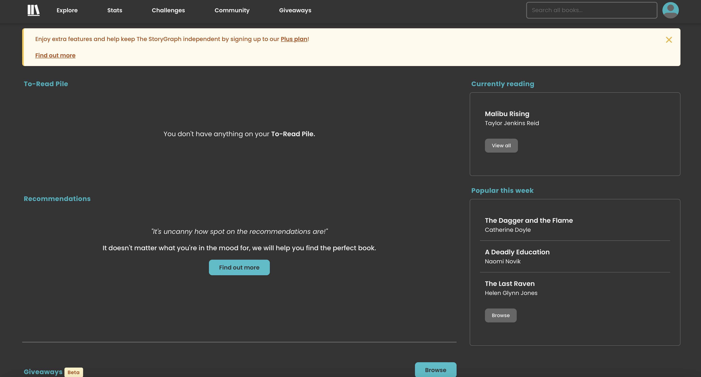
*Figure 1.1: The StoryGraph Search Bar.*

#### Goodreads 

For Goodreads, locating a book relies on the platform's search bar. This works very efficiently for direct searches by title or author. Two users experienced errors while performing this task and there was an average of 8.2/10 for satisfaction. Both users that experienced errors had the same issue where they entered the full name of the book and the author and a summary of the book came up instead of the actual book. 

Despite its efficiency, Goodreads' interface is cluttered and overwhelming due to the large number of advertisements. Goodreads offers recommendations and various genre categories, these are sometimes hidden among other content, making it less intuitive.  A challenge for Goodreads could be the “Aesthetic and Minimalist Design” principle where the abundance of content and ads can clutter the interface. This could frustrate users which could be why users reported errors or expressed difficulty navigating certain features. 

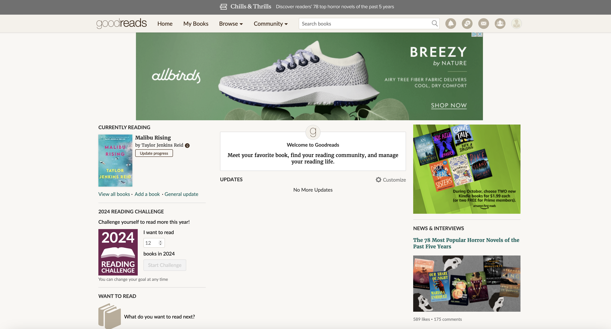
*Figure 1.2: The Goodreads Search Bar.*

### Task 2: Update reading progress

#### Goodreads

The process of updating reading progress on Goodreads is counterintuitive and many participants found it frustrating. In order to update progress, a Goodreads user must first set the book's status to "currently reading" from the book page as shown in Figure 2.1. From there users must navigate to the home page, where the "Update Progress" button is located as highlighted in Figure 2.2. Upon pressing that button, a user can then input a page number or percentage in the form shown in Figure 2.3.

Many users had a difficult time accomplishing this task as they sought the update progress button on the book’s details page or the "My Books" page. By only allowing for updates through the small update progress button on the homepage, Goodreads makes the feature difficult to find. 

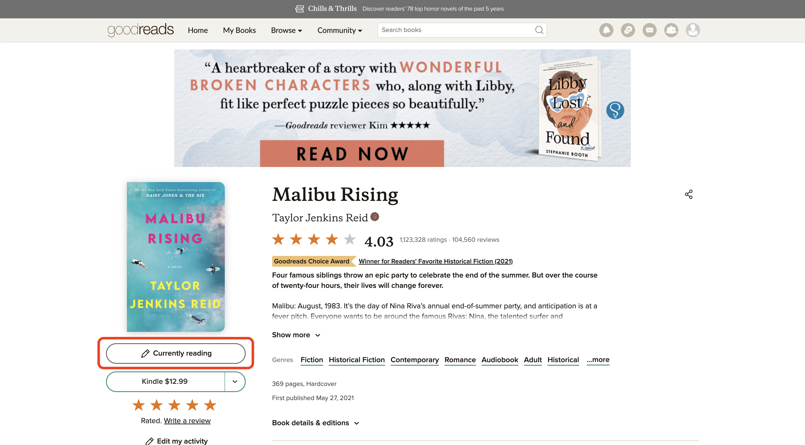
*Figure 2.1: The Goodreads book page for Malibu Rising, where book status can be changed.*

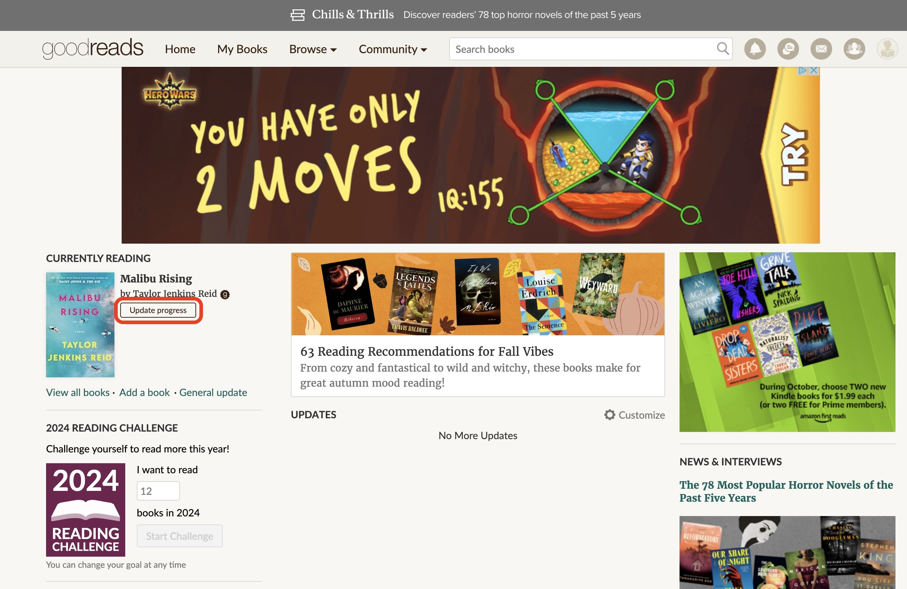
*Figure 2.2: The Goodreads homepage, which displays currently reading books.*

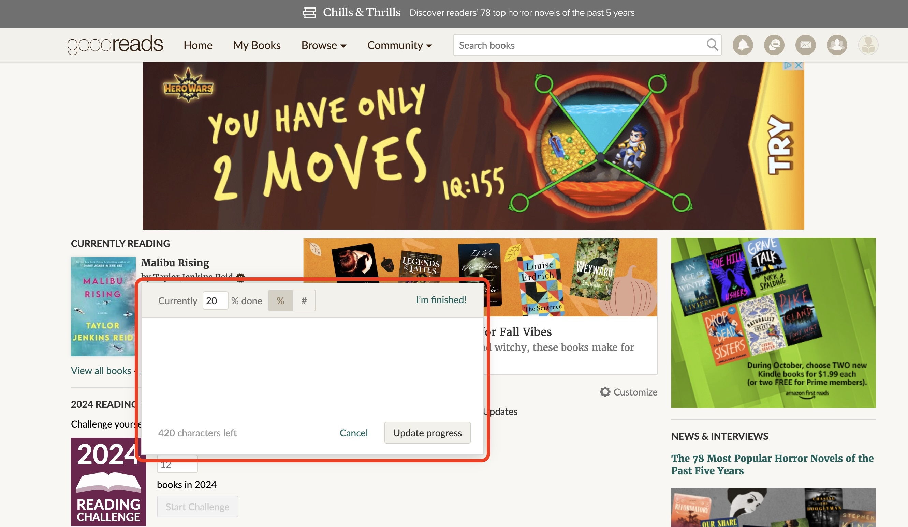
*Figure 2.3: The popup for inputting book progress.*

Even an experienced Goodreads user can have a difficult time updating reading progress if they haven't completed the action recently. This demonstrates a failure in the design principle of recognition rather than recall, as users are forced to expend effort to remember the button's location. It would be more intuitive for this feature to be available everywhere the book's status is displayed, as this would allow for flexibility and efficiency of use.

#### StoryGraph

Updating reading progress was significantly easier for participants when using StoryGraph. The average time it took to complete this task on StoryGraph was almost two minutes faster than on Goodreads and the process involved considerably fewer errors. This is due to the fact that StoryGraph placed the track progress button on the book details page, a design choice that means users don’t need to search around the site for it like they did on the Goodreads. 

In order to track progress, users must first change the book status to currently reading using the dropdown highlighted in Figure 2.4. After updating the status, a track progress button appears above the dropdown. When this button is pressed a form appears where users can input a page number or percentage to update their progress as displayed in Figure 2.5.

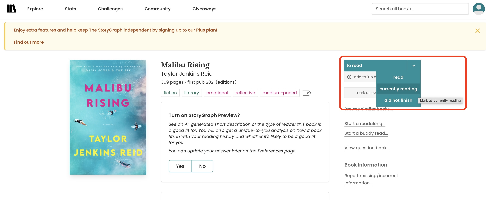
*Figure 2.4: The StoryGraph book page for Malibu Rising.*

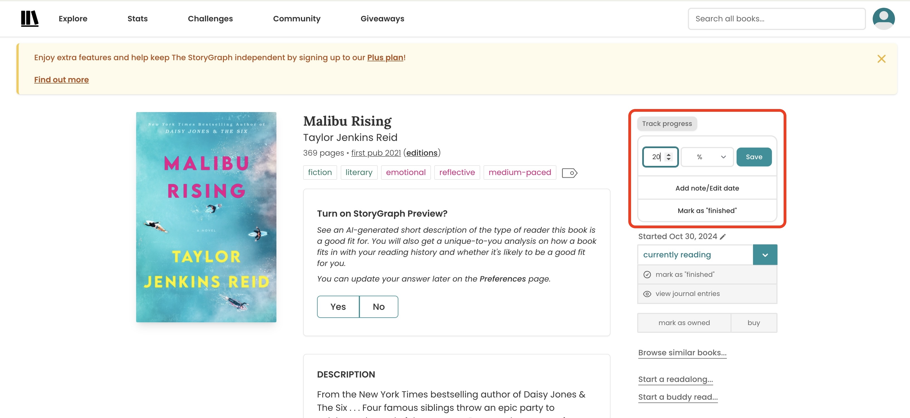
*Figure 2.5: The StoryGraph form for updating book progress.*

Overall StoryGraph received an average satisfaction rating 5.2 points higher than the score Goodreads received for this task. This is largely due to better consistency and standards present in StoryGraph's design. Users don't need to relearn the site's layout in order to update reading progress on StoryGraph.

### Task 3: Five star rating 
Goodreads and StoryGraph have a rating feature to allow users to evaluate how they feel about a book. However, the process of giving a rating is different between the two and varies in simplicity. 

#### Goodreads
For Goodreads, locating where to rate the book starts with finding the book title and opening the book information. Below the book image and shelving option, there are 5 star icons where the user can quickly rate a book from 1 to 5 stars. This simplifies needing to write a full lengthy review with commentary. After rating the star, there is visual feedback that the rating has been updated and is being saved on the bottom left corner of the screen. However, because there are two large star icons on the screen, some users had confusion between which stars were for rating and which was the average rating of the book from other users. Therefore, the low prominence of the rating section could be optimized by changing the order of placement. This task had a quick learnability rate with an average of 12.7 seconds to complete and satisfaction average of 8.2/10 implying that the feature is overall effective in its purpose.

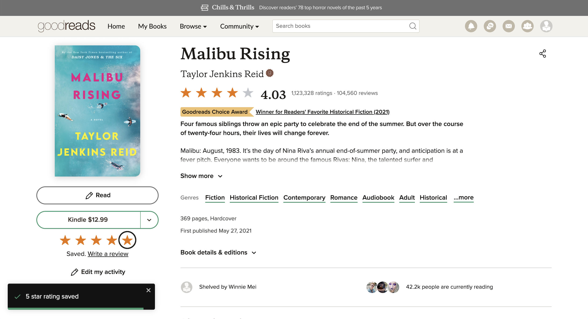
*Figure 3.1: Goodreads book information page with five star rating accessible.*

#### StoryGraph

For StoryGraph, the process of rating a book takes more steps for the average user to complete. In order to rate the book, the user needs to mark the book as ‘read’ or ‘finished’ which will then allow the user to add a star rating. After clicking the ‘add review’ button, the user then has to scroll to the bottom of the page to access the star rating, skipping the optional commentary sections. After giving a 5 star rating, the screen will automatically refresh to see your review and star rating below the book title. 

This task frustrated many participants because it was unclear that you must mark the book as read before being able to add a review. The process is not obvious to a new user as the rating form is hidden until they update the book's status to completed. The average learnability time spent on this task was 63.8s with the highest amount of time a user spent being 306s. The overall satisfaction rate for this task was also a 7/10. Overall, this feature is seemingly less effective on this platform since more participants were confused on where to locate the feature.

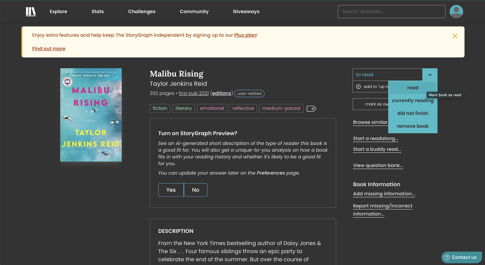
*Figure 3.2: The StoryGraph book information page to change reading status from 'to read' to 'read'.*

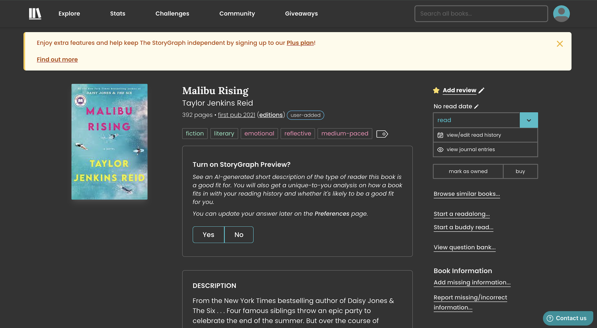
*Figure 3.3: The StoryGraph book information page after reading status changed to 'read' for the review section to appear.*

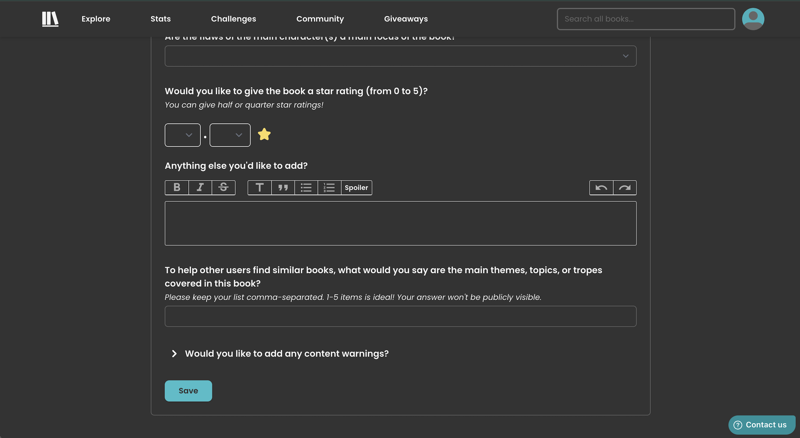
*Figure 3.4: The StoryGraph review page scrolled to the bottom to show the star rating section.*

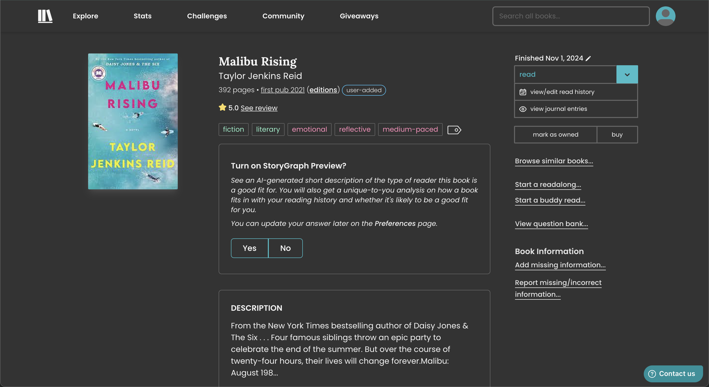
*Figure 3.5: The StoryGraph book information page updated with user's star rating.*

### Prioritization of Metrics
Satisfaction is the most crucial metric for evaluating Goodreads and StoryGraph because these applications are used during users leisure time and a positive experience is essential if users are to keep using the applications. A high satisfaction score means users enjoy the platform enough to consistently use it. Learnability is the next priority, as a user-friendly interface helps new users to quickly understand the application. This will determine if new users will continue using the platform or switch to another application. Errors are also important to measure as repeated errors can cause a user to leave the platform. Minor errors are acceptable as long as issues are learned and resolved. 

### Usability Decision
After comparing usability for Goodreads and StoryGraph across the three tasks, we have concluded that StoryGraph is the more usable app based on learnability, error frequency, and user satisfaction.
1. Learnability: For Tasks 1 and 2, StoryGraph enabled significantly faster completion times. In Task 2, StoryGraph users completed the task in an average of 36.2s, 142s faster on average than Goodreads' 178.2s. While Goodreads performed better in terms of learnability for Task 3, the margin of 51.1s was much smaller compared to that of Task 2.
2. Errors: Overall, errors were less frequent on StoryGraph. Out of the 20 errors recorded across both platforms during all 3 tasks, only 5 occurred while using StoryGraph.
3. Satisfaction: User satisfaction ratings overall favored StoryGraph. When averaging the average satisfaction scores for all three tasks, StoryGraph received a score of 8/10 compared to Goodreads' 6.5/10.

In conclusion, while Goodreads remains popular for its extensive social features, StoryGraph is a more usable option for users focused on tracking and rating books efficiently. Its streamlined interface, reduced error rate, and higher satisfaction make it the better choice for general usability in book tracking tasks.

## Statement of Work
We all separately conducted user tests and analyzed the data together. We then divided up the remaining work and came back together to write the final Usability Decision report. Below is a detailed list of how we divided the work.

- Giselle: Task Prioritization of Metrics, Task 1: Heuristic Evaluation
- Kate: Study Description, Task 2: Heuristic Evaluation
- Raihana: Study Results, Task 3: Heuristic Evaluation

